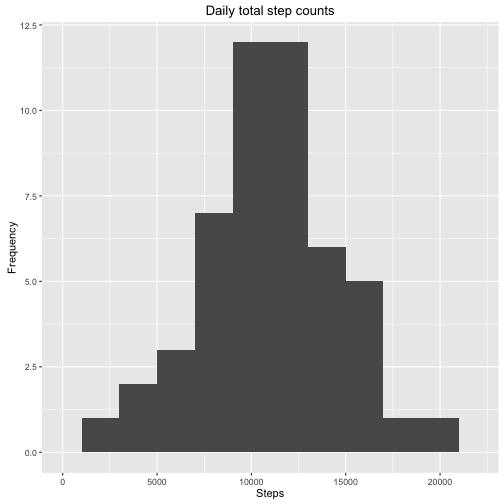

Tod Wright 14 August 2016

This is a report submitted for peer assessment for week 2 of the Coursera Reproducible Research course.  In it we process and analyze data from a personal activity monitoring device, consisting of step counts recorded during 5 minute intervals during the months of October and November 2012.

We begin by loading the `ggplot2` library, which we will use to create figures in this report.

```r
library(ggplot2)
```


## Loading and preprocessing the data
The data to be analyzed is stored in comma separated form in the file `activity.csv` and we load this data using `read.csv()`.  The data contains a column of date strings, so we specify the option `stringsAsFactors = FALSE` and then use the function `as.Date()` to convert these strings to `Date` objects.

```r
activity <- read.csv("activity.csv", header = TRUE, stringsAsFactors = FALSE)
activity$date <- as.Date(activity$date)
```


## What is mean total number of steps taken per day?
To calculate the mean number of steps taken on each day, we use the `aggregate()` function to group the data by the `date` column and summarize it using the `sum()` function.  

```r
total_steps <- aggregate(steps ~ date, data = activity, sum)
```
We note that when using this "formula" form of the `aggregate()` function, any `NA` values present are ignored by default. Next we plot a histogram of the daily total step counts using the `qplot()` function.

```r
qplot(steps, data = total_steps, xlim = c(0, 22000), bins = 12,
      xlab = "Steps", ylab = "Frequency", main = "Daily total step counts")
```



We also calculate the mean total number of steps taken each day:

```r
mean(total_steps$steps)
```

```
## [1] 10766.19
```
and the median total number of steps taken each day:

```r
median(total_steps$steps)
```

```
## [1] 10765
```
We remark that, for these data, the mean and median daily step counts are very close to each other.


## What is the average daily activity pattern?
Next we consider the average daily activity pattern, i.e., the time series of steps taken in each 5-minute time interval, averaged over the days for which all step records are present in the data set.  To form this average daily time series, we again use the "formula" form of the `aggregate()` function, which ignores `NA` values by default, this time grouping by `interval` and summarizing with the function `mean()`.

```r
daily <- aggregate(steps ~ interval, data = activity, mean)
```
We then use `qplot` with the option `geom = "line"` (equivalent to `type = "l"` in the `base` plotting package) to create the time series plot.

```r
qplot(interval, steps, data = daily, geom = "line",
      main = "Average daily activity pattern")
```


The time interval that, after averaging across all the days in the data set for which step records are present, is given by

```r
daily[which.max(daily$steps), "interval"]
```

```
## [1] 835
```
i.e., the interval between 8:35am and 8:40am, with an average of

```r
max(daily$steps)
```

```
## [1] 206.1698
```
steps.


## Imputing missing values
The total number of missing values in the data set is given by

```r
sum(is.na(activity$steps))
```

```
## [1] 2304
```
To devise a scheme for imputing some representative values for these missing measurements, we first consider the pattern of missing values in more detail. We note first that the length of the set of time intervals in a single day is

```r
length(daily$interval)
```

```
## [1] 288
```
Next, we use the `aggregate()` function with a custom summary function to form a data frame containing the number of missing values for each day in the data set

```r
total_missing <- aggregate(steps ~ date, data = activity, function(x){sum(is.na(x))}, 
                           na.action = na.pass)
names(total_missing) <- c("date", "missing")
```
and investigate the range of values that this count of missing days takes:

```r
unique(total_missing$missing)
```

```
## [1] 288   0
```
We see, therefore, that every date in the data set has either no missing values at all or all of its values are missing.  For each date with missing measurements we will therefore simply replace the day's entire time series with the average time series calculated above. 

To do so, we first identify the dates with missing values:

```r
bad_dates <- total_missing[total_missing$missing > 0, "date"]
```
We then make a copy of the original `activity` data frame and loop over the "bad" dates, assigning to each in turn the mean time series calculated above

```r
activity_filled <- activity
for (i in seq_along(bad_dates)) {
  activity_filled[activity_filled$date == bad_dates[i], "steps"] <- daily$steps
}
```

Next, we make a histogram of the total number of steps taken each day according to the new data set, with the missing values having been imputed.  As before, we first use the `aggregate()` function to group the data by the date column and summarize it using the `sum()` function

```r
total_steps_filled <- aggregate(steps ~ date, data = activity_filled, sum)
```
We then create a histogram using `qplot()`

```r
qplot(steps, data = total_steps_filled, xlim = c(0, 22000), bins = 12,
      xlab = "Steps", ylab = "Frequency", 
      main = "Daily total step counts (missing values imputed)")
```


We again calculate the mean total number of steps taken each day

```r
mean(total_steps_filled$steps)
```

```
## [1] 10766.19
```
which is unchanged, is it must be for the imputation scheme we have used (adding samples with values equal to the mean of the existing samples in a data set leaves the mean unchanged).  We then calculate the median total number of steps taken each day

```r
median(total_steps_filled$steps)
```

```
## [1] 10766.19
```
which is in fact the same as the mean.  Although this result certainly looks suspicious (i.e., as if we have made some mistake in our calculations), it is in fact correct.  We recall that in our original calculation of the mean and median total number of steps per day, the median was found to be very close to the mean.  When filling in missing values of the data set, we have effectively added several days with total step counts equal to the mean, and as the median was originally close to the mean, these days fall "in the middle" of the collection of days when they are ordered by their total step counts.  Evidently the "middle" day after ordering, (i.e., that to which the median corresponds) is one of these added days, and therefore the median is equal to the mean in this case.


## Are there differences in activity patterns between weekdays and weekends?
To compare the activity patterns between weekdays and weekends, we first form a boolean vector that indicates, for each observation in the (filled-in) data set, whether the observation was made on a weekday or a weekend

```r
is_weekend <- weekdays(activity_filled$date) %in% c("Saturday", "Sunday")
```
We then add a new factor variable to the data frame, indicating the type of day (weekday or weekend) corresponding to each observation

```r
activity_filled$daytype <- factor(as.numeric(is_weekend), levels = c(0:1),   
                                  labels = c("weekday", "weekend"))
```
From this we can then use the `aggregate()` function to form an average daily time series for both weekdays and weekends

```r
daily_wkdaywkend <- aggregate(steps ~ interval + daytype, data = activity_filled, mean)
```
We plot the two resulting time series using `qplot()`, separating into two panels by the day type.

```r
qplot(interval, steps, data = daily_wkdaywkend, geom = "line", facets = daytype ~ .,
      main = "Average daily activity pattern (weekdays and weekends)")
```


This plot shows a somewhat different mean activity pattern on weekends as compared to weekdays, as might be expected.
